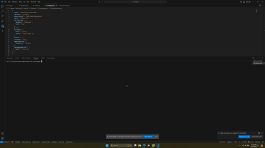

# SVG Shape Generator 
  
  ## Description
  Take user input and generate an SVG logo
  ## Deployed Application URL
  n/a
  ## Video
  
  ## Table of Contents
  * [Features](#features)
  * [Languages & Dependencies](#languagesanddependencies)
  * [Usage](#Usage)
  * [Contributors](#contributors)
  * [Testing](#testing)
  * [Questions](#questions)
  ## Features
  Exports SVG based off of user input. Includes unit tests
  ## Languages & Dependencies
  node, jest, inquirer
  ## Usage:
  node, jest, inquirer
  ## Contributors
  N/A
  ## Testing
  `npm test` to run shape unit tests
  ## Questions
  Please send your questions [here](mailto:sondavid85@yahoo.com?subject=[GitHub]%20Dev%20Connect) or visit [github/sondavid85](https://github.com/sondavid85).
  
